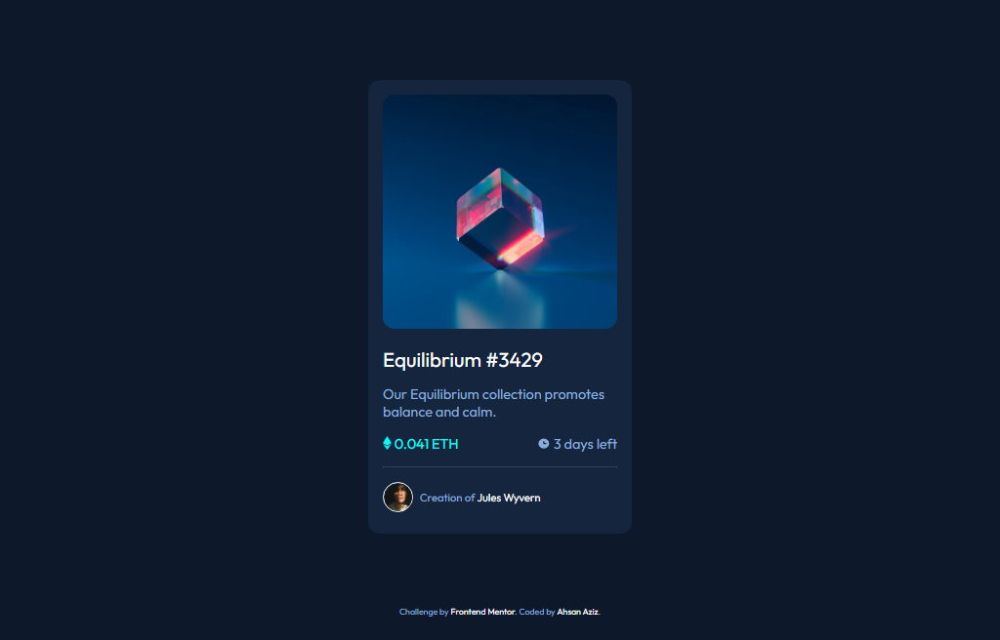

# Frontend Mentor - QR code component solution

This is a solution to the [QR code component challenge on Frontend Mentor](https://www.frontendmentor.io/challenges/qr-code-component-iux_sIO_H). Frontend Mentor challenges help you improve your coding skills by building realistic projects.

## Table of contents

  - [Screenshot](#screenshot)
  - [Links](#links)
  - [Built with](#built-with)
  - [What I learned](#what-i-learned)
  - [Useful resources](#useful-resources)
  - [Author](#author)

### Screenshot

### Links

- Solution URL: [Solution URL](https://github.com/AhsanAziz082/nft-preview-card-component)
- Live Site URL: [Live site URL](https://ahsanaziz082.github.io/nft-preview-card-component/)

### Built with

- Semantic HTML5 markup
- CSS custom properties
- Flexbox
- Mobile-first workflow

### What I learned

This is very interesting project. I learn in this project CSS Flexbox property and image overlay property.

### Useful resources

- [CSS Flex Property MDN](https://developer.mozilla.org/en-US/docs/Web/CSS/flex) - This helped me for understand CSS Flex Property.
- [CSS Overlay Property w3schools](https://www.w3schools.com/howto/howto_css_image_overlay_icon.asp) -This helped me for understand CSS Overlay Property.

## Author

- Frontend Mentor - [@AhsanAziz082](https://www.frontendmentor.io/profile/AhsanAziz082)
- Twitter - [@iamahsanaziz](https://www.twitter.com/iamahsanaziz)
